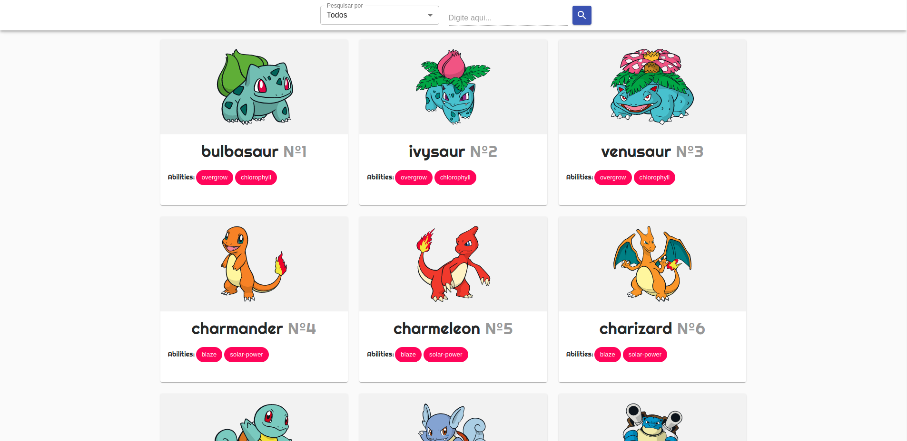

# pokemon



<h1 align="center">
    Pokémon App
</h1>

Contents
=================

<p>
    <a href="#install">Install dependencies</a> •
    <a href="#run">Run application</a> •
    <a href="#versions">Versions</a> •
    <a href="#view">Demo</a> •
</p>

<div id="install">

1. **Install dependencies with npm:**

```bash
npm install
```
</div>

2. **Running application:**

```bash
npm start
```
</div>

</div>

3. **Versions:**

| Plugin  | Version |
| ------------- | ------------- |
| ReactJs  | 17.0.2  |
| NodeJs  | 14.16.0  |
| NPM  | 7.6.3  |
| react-scripts  | 2.0.3 |
| typescript  | 4.1.2 |

</div>

4. **DEMO:**

<a href="https://jeffersoncosta.github.io/pokemon">https://jeffersoncosta.github.io/pokemon</a> •

</div>
